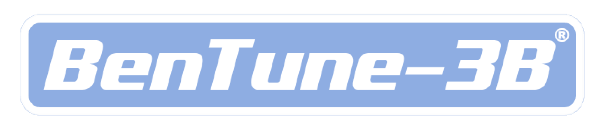

  
  
An instruction-tuned LLaMA-3.2B assistant developed at Arizona State University

---

## Overview

BenTune-3B is a lightweight, fine-tuned version of Meta’s LLaMA-3.2B model, optimized for general-purpose instruction following. Developed entirely on ASU’s SOL cluster, this project aims to explore low-latency inference, modular fine-tuning, and evaluation of open-weight LLMs under academic resource constraints.

The model is capable of answering diverse instruction-based prompts ranging from logical reasoning and factual queries to summarization and coding tasks.

---
## BenTune v1 vs v2

| Feature                          | **BenTune v1**                                                  | **BenTune v2**                                                                |
|----------------------------------|------------------------------------------------------------------|--------------------------------------------------------------------------------|
| Training Samples                 | 85,000 examples                                                  | 135,000 examples                                                              |
| Epochs                           | 3 epochs                                                         | 2 epochs                                                                      |
| Additional Datasets              | None                                                             | 3 small coding datasets; more knowledge-heavy and safety-aligned sources      |
| Focus Areas                      | General instruction-following and reasoning                      | Knowledge coverage and safety alignment                                       |
| Response Quality (General/Reasoning) | Higher quality responses due to focused dataset                  | Slightly degraded in general/reasoning tasks due to distributional shift      |
| Alignment Behavior               | Less constrained, more natural responses                         | More cautious and safety-aware responses                                       |

> *Note:* While v2 saw improvements in factuality and safety alignment, it often produced more conservative or less precise outputs on abstract or multi-step reasoning tasks. BenTune v1, with its narrower dataset focus, generated more robust general-purpose and logic-based completions.
---
## ARC Evaluation Comparison

**Legend**  
- **ZS (Zero-shot):** Model receives the question only, with no examples.  
- **5-shot:** Model is shown five examples before the test question.  
- **CoT (Chain-of-Thought):** Prompts include intermediate reasoning steps to encourage logical breakdowns.

| **Evaluation Setting**           | **Meta Instruct** | **BenTune v1** | **BenTune v2** |
|----------------------------------|-------------------|----------------|----------------|
| ARC-Challenge (Zero-shot)        | **43.69%**        | 40.70%         | 38.74%         |
| ARC-Challenge (5-shot)           | **46.67%**        | 42.15%         | 41.64%         |
| ARC-Challenge (Zero-shot + CoT)  | **41.89%**        | 39.51%         | 36.86%         |
| ARC-Challenge (5-shot + CoT)     | **46.16%**        | **43.17%**     | 43.00%         |
| ARC-Easy (Zero-shot)             | 73.95%            | **74.41%**     | 71.25%         |

### Highlights

- **BenTune v1** delivers performance close to **Meta Instruct**, especially in 5-shot + CoT, and surpasses it on **ARC-Easy**, demonstrating strong general reasoning.
- **BenTune v2** shows slightly lower accuracy across all settings, reflecting a tradeoff made for improved alignment and safety handling.
- **Meta Instruct** leads in most settings, but **BenTune v1** performs competitively despite having significantly fewer training examples and using PEFT-based fine-tuning.

### Interpretation

- The results show that **BenTune v1** effectively captures logical and general-purpose reasoning with compact training.
- **BenTune v2**, while better aligned for safety and factual knowledge, sacrifices performance on abstract or logic-heavy benchmarks.
---
## Inference Strategies

We tested three key decoding techniques during inference:

- **Forced Chain-of-Thought (CoT)**  
- **Dynamic CoT Triggering**  
- **Self-Consistency Decoding**

Performance varied based on the nature of the prompt. While some reasoning tasks benefited from CoT strategies, others did not show significant improvement. Due to time constraints, we were unable to fully explore these behaviors across all benchmark categories.

---
## Example Responses

## General Instruction-Following: Greeting Message Comparison

**Q1. Write a one-sentence greeting message.**

| Inference Method              | BenTune v1                                     | BenTune v2                                                  | Meta Instruct Model                                                                                                                                                    |
|------------------------------|------------------------------------------------|-------------------------------------------------------------|------------------------------------------------------------------------------------------------------------------------------------------------------------------------|
| **No Inference Optimizations** | Hello                                         | Hi, how are you?                                            | <!–[INST]...Hello, how are you today?...</INST>                                                                                                                        |
| **CoT Forced**               | Hello, I am a bot. How can I help you?         | Hello.                                                      | <</SYS>> <</STEP> <</MSG>> ... (garbled/system-token-filled output)                                                                                                    |
| **Dynamic CoT**             | Hello!                                         | Hello!                                                      | We can start by considering the purpose of the greeting message... "Hello, I'm glad you're here and I'm looking forward to chatting with you!"                      |
| **Self Consistency**        | Hello, how are you doing today?               | Hello                                                       | A14. Parametric tests assume a specific distribution (e.g., normality) for the data, whereas non-parametric tests do not... (unrelated)                                |
| **Self Consistency + CoT**  | Hello!                                         | Hello, my name is Open Assistant. How may I assist you?     | Please let me know if this meets your requirements or if you'd like me to make any adjustments! (not a greeting; meta response)                                        |

---

## UI Interface

...
---

## Team

- Jaya Adithya Pavuluri  
- Deep Goyal  
- Namita Shah  
- Evan Zhu  
- Navni Athale  

Project developed for CSE 476: Intro to NLP at Arizona State University.

---

## License

TBD
